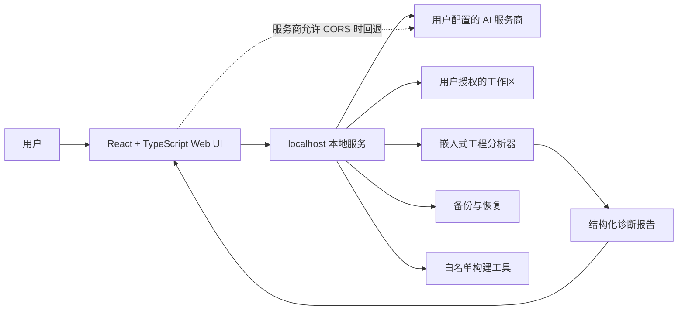

# MetaCore Studio

[简体中文](./README.md) | [English](./README_EN.md)

<p align="center">
  
</p>

> 面向 ESP32、STM32 与自定义芯片的 AI 硬件设计、固件生成和本地嵌入式工程分析平台。当前版本集成了可选的 DeepSeek Harness Runtime，用于受控的 Agent 编排与工程协作。

[](https://react.dev/)
[](https://www.typescriptlang.org/)
[](https://vite.dev/)
[](https://nodejs.org/)
[](#版本状态)
[](#许可证)

MetaCore Studio 将自然语言硬件需求转化为以项目生命周期为中心的嵌入式研发流程：

```text
项目创建 -> 需求澄清 -> 硬件设计 -> 固件实现 -> 一致性验证 -> 本地诊断 -> 构建验证 -> 发布检查 -> 导出
```

浏览器应用负责产品界面和 AI 工作流；localhost 服务负责 AI 代理、本地工作区分析、安全文件操作、备份和构建验证。

## 目录

- [功能亮点](#功能亮点)
- [产品工作流](#产品工作流)
- [ESP32 专精](#esp32-专精)
- [系统架构](#系统架构)
- [版本状态](#版本状态)
- [赞助支持](#赞助支持)
- [环境要求](#环境要求)
- [快速开始](#快速开始)
- [本地工程模式](#本地工程模式)
- [AI 服务](#ai-服务)
- [后台任务与 Agent Runtime](#后台任务与-agent-runtime)
- [DeepSeek Harness 使用手册](#deepseek-harness-使用手册)
- [典型使用流程](#典型使用流程)
- [示例工程](#示例工程)
- [常用命令](#常用命令)
- [项目结构](#项目结构)
- [安全边界](#安全边界)
- [测试](#测试)
- [版本规范](#版本规范)
- [更新日志](#更新日志)
- [故障排查](#故障排查)
- [已知限制](#已知限制)
- [参与贡献](#参与贡献)
- [GitHub 协作文件](#github-协作文件)
- [许可证](#许可证)
- [作者的话](#作者的话)

## 功能亮点

| 模块 | 能力 |
| --- | --- |
| 硬件方案 | 芯片选择、GPIO 分配、BOM、接线表和引脚可视化 |
| AI 候选选型 | 一键获取最常用/最优/最有性价比/最好四类候选，支持自动选型和确认后一键生成 |
| 选型权重 | 四类偏好拖动分配 0-100 点，合计严格为 100，并保存选型依据 |
| ESP32 专精 | 五个常用系列的开发板 profile、正确 board ID / IDF target、Flash/PSRAM/USB/无线能力与 GPIO 约束 |
| 固件生成 | 为 Arduino、PlatformIO、ESP-IDF 和 STM32CubeIDE 生成模块化 C/C++ 工程 |
| 外设驱动库 | 内置 SSD1306、DHT、AHT20、WS2812、HC-SR04、蜂鸣器、舵机和 DRV8833 模板 |
| AI 一致性检查 | 生成代码后自动检查代码与硬件方案是否一致 |
| 流程图可视化 | 根据工程代码生成可交互执行流程图，并提供 AI 工程问答 |
| 自定义芯片 | 支持数据手册解析、AI 辅助填写和手动芯片参数配置 |
| 本地工程诊断 | 目录浏览、全文搜索、代码预览、静态分析、健康评分和诊断报告 |
| 安全文件操作 | 用户确认后写入、修改时间冲突检测、自动备份和恢复 |
| 构建验证 | 检测并运行白名单内的 PlatformIO、ESP-IDF 和 CMake 构建 |
| 项目导出 | 导出 ZIP 固件工程和格式化 PDF 设计文档 |
| 项目迁移 | 导入、导出经过校验的 `.metacore.json` 项目归档，不包含 API Key |
| 项目生命周期 | 统一的阶段、产物新鲜度、版本、运行记录、取消和重试 |
| Agent Runtime | localhost Job、SSE 事件、Session 轨迹、工具权限和审批策略 |

## 产品工作流

应用打开后进入 `/workspace` 工作台，研发流程收敛为五个一级板块：

1. `工作台`：查看当前项目、阶段、产物状态、连接状态和下一步动作。
2. `设计`：需求、芯片、外设、方案、引脚、BOM、接线和设计审查。
3. `实现`：固件生成、文件树、Monaco、代码状态、版本和导出。
4. `验证`：一致性、流程图、本地分析、构建、安全和发布检查。
5. `项目`：项目切换、导入、导出和删除。

当前项目使用 Project Schema v3 和明确的 `ProjectStage`。需求、方案、引脚、代码、流程、本地分析、构建和发布检查都作为带版本的 Artifact 保存；上游变化会把下游结果标为 `stale`，过期结果不能继续显示为已通过。旧项目会在加载时补全 ESP32 默认开发板配置，不需要清除浏览器数据。

### AI 候选选型与保守方案

当用户不确定传感器、驱动器、电源、通信模块或其他器件型号时，需求确认对话框提供两个一键操作：

1. `一键生成全部候选`：让 AI 针对每个未确认问题返回四类候选，并列出型号、选择理由、成本估算、稳定性、风险和复核项。
2. `AI 自动选择`：优先选择通过安全门槛、资料完整且供应稳定的候选，然后按权重给出保守推荐。

四类偏好为最常用、最优、最有性价比和最好，使用滑杆分配 0-100 点；拖动任意一项时，其他项会自动重新分配，四项始终合计 100。权重只用于已通过安全门槛的候选排序，不能覆盖电压、电流、热设计、保护、引脚或数据手册约束。确认后点击 `用所选型号生成方案`，系统会把已选型号、权重和安全摘要带入方案提示词。

完整状态机、stale 传播规则和恢复行为见 [`docs/PRODUCT_WORKFLOW.md`](docs/PRODUCT_WORKFLOW.md)。

## ESP32 专精

v2.4.0 首批覆盖五个常用系列，并把 SoC、模组、开发板和构建标识分开管理：

| 系列 | 默认开发板 | PlatformIO board | ESP-IDF target | 重点能力 |
| --- | --- | --- | --- | --- |
| ESP32 | ESP32 Dev Module | `esp32dev` | `esp32` | 成熟生态、Wi-Fi、经典蓝牙/BLE |
| ESP32-S3 | ESP32-S3-DevKitC-1 N8 | `esp32-s3-devkitc-1` | `esp32s3` | USB、BLE 5、向量指令 |
| ESP32-C3 | ESP32-C3-DevKitM-1 | `esp32-c3-devkitm-1` | `esp32c3` | 低成本 RISC-V、Wi-Fi、BLE 5 |
| ESP32-C6 | ESP32-C6-DevKitC-1 | `esp32-c6-devkitc-1` | `esp32c6` | Wi-Fi 6、BLE 5、Thread、Zigbee |
| ESP32-S2 | ESP32-S2-Saola-1 | `esp32-s2-saola-1` | `esp32s2` | USB OTG、Wi-Fi、无蓝牙 |

新建项目或编辑需求时，ESP32 配置向导会显示模组、Flash、PSRAM、USB、无线协议、分区、上传速度和串口速度。生成前会校验开发板与框架是否兼容，生成后会检查保留、仅输入、启动和 USB 共用 GPIO。PlatformIO 模板不再固定写成 `esp32dev`。

普通用户的推荐顺序是：

```text
选择开发板/模组 -> 选择框架 -> 确认 Flash/PSRAM/分区 -> 确认上传与串口速度
-> 输入外设需求 -> 自动规划 GPIO -> 生成代码 -> 构建 -> 烧录/串口监视
```

五个系列的配置差异、Arduino/PlatformIO/ESP-IDF 实际命令和后续路线见 [`docs/ESP32_SPECIALIZATION.md`](docs/ESP32_SPECIALIZATION.md)。

## 系统架构



完整模式必须同时运行前端和 `localhost` 服务。AI 请求默认统一通过本地网关发送，避免浏览器 CORS 和凭据暴露；只有开发者显式设置 `VITE_METACORE_ALLOW_DIRECT_AI=true` 时才允许浏览器直连。

## 版本状态

当前版本：**v2.5.0-harness.2**，发布日期为 `2026-08-25`。本版本增加 AI 保守候选选型、四类权重可视化和确认后一键生成方案。

2.5.0-harness.1 在保留原有硬件设计、固件生成和本地分析工作台的基础上，增加可切换的 DeepSeek Harness Runtime、Cordis 插件组合、Session/Agent 事件轨迹、受控 MetaCore 工具桥、文件 Diff 审批、构建审批和 Runtime 状态卡片，并统一 AI 网关、设置页 DeepSeek 凭据和 Harness Agent 调用链。Harness 只负责 Agent loop、工具编排和子 Agent；工作区路径、备份、修改时间冲突、构建白名单和最终批准仍由 MetaCore localhost 服务负责。

> [!IMPORTANT]
> MetaCore Studio 生成的是工程建议和参考代码，不是经过认证的量产硬件。请始终根据真实芯片手册和目标开发板复核引脚、电气限制、依赖和固件行为。

> [!CAUTION]
> 本地工作区可能包含源代码。只有用户主动发起 AI 分析时，相关上下文才会提交到所选服务商。不要选择包含私钥、生产凭据或无关个人数据的目录。

## 赞助支持

VPS.Town 是一家专注于 VPS 与云服务器服务的平台，为开发者、个人站长及项目团队提供稳定、灵活的云计算资源，适用于网站部署、应用托管、开发测试以及个人项目运行等场景。感谢 VPS.Town 对 MetaCore Studio 项目开发与公开协作的支持。

<a href="https://vps.town/" target="_blank" rel="noreferrer">
  
</a>

- [访问 VPS.Town 官网](https://vps.town/)

## 环境要求

- Windows、macOS 或 Linux
- Node.js 20.19 或更高版本
- npm 9 或更高版本
- 使用 AI 生成或 AI 诊断时，需要一个兼容的 AI 服务
- 只有进行本地构建验证时，才需要 PlatformIO、ESP-IDF 或 CMake

## 快速开始

### 第一次使用：推荐完整模式

完整模式同时启动 Web 前端和 localhost 工程服务，才能使用 AI 网关、本地工程分析、文件备份和构建验证。

```bash
git clone https://github.com/LEO-Ricardo20/MetaCore-Studio.git
cd MetaCore-Studio
npm ci
```

Windows 用户安装依赖后直接双击 `start.bat`。它会检查 Node.js 和依赖，启动或复用 `127.0.0.1:3766` 本地服务，等待健康检查通过后再打开 Web 前端。旧入口 `start-local.bat` 保留为兼容别名，行为相同。

如果不使用脚本，也可以手动打开两个终端：

```bash
# 终端 1：localhost 工程服务和 AI 网关
npm run dev:server

# 终端 2：Web 前端
npm run dev
```

Vite 通常会输出 `http://127.0.0.1:5173` 或 `http://localhost:5173`。浏览器打开该地址后，第一次使用建议先点侧栏的“新手教程”，再按“设置 AI → 需求 → 方案 → 实现 → 验证 → 导出”的顺序操作。

### 仅浏览器模式

```bash
npm run dev
```

仅浏览器模式适合查看界面和不依赖本地文件的功能。它不会启动 localhost 服务，因此“本地”工作区、AI 网关、文件备份和构建验证不可用，浏览器直连 AI 还可能受到 CORS 限制。

## 本地工程模式

本地服务监听 `127.0.0.1:3766`，Web UI 通常监听 `127.0.0.1:5173`。

打开“本地”页面，设置工作区路径并点击“扫描”。分析器可以识别：

- PlatformIO、ESP-IDF、Arduino、STM32CubeIDE 和 CMake 工程
- ESP32、ESP32-S3、ESP32-C3、ESP32-C6、ESP32-S2、STM32F103 和 STM32F4 相关代码
- GPIO 定义和常见引脚调用
- DHT、OLED、WS2812、舵机、电机、I2C、SPI 和 UART 线索
- Wi-Fi、MQTT、HTTP、WebSocket、BLE、LoRa、Zigbee、Modbus 和 CoAP 线索
- `#include` 依赖和 PlatformIO `lib_deps`
- 代码规模、语言分布和注释比例
- 硬编码凭据和明文网络端点

服务不会把当前工作区暴露到公网。文件写入需要用户确认，并会在修改前创建备份。

本地 API 说明见 [`docs/LOCAL_API.md`](docs/LOCAL_API.md)。

## AI 服务

在“设置”页面配置 AI 服务。当前支持：

- DeepSeek
  - 硅基流动（默认建议 `deepseek-ai/DeepSeek-V4-Flash`）
- 通义千问
- OpenAI Responses API
- Ollama 本地模型
- 自定义 OpenAI 兼容服务

自定义服务可以选择：

- Responses API
- Chat Completions API

`autobits.cc` 类型的 CCH 服务会自动使用 Responses API。其他中转平台应以其官方文档和 `/models` 返回结果为准。

当前实现将 API Key 保存到浏览器 `localStorage`。浏览器存储不属于 Git 工作区，不会被 `git add`、commit 或 push 上传。AI 请求默认只通过 localhost MetaCore 网关；服务只把 Key 转发给用户配置的目标服务商，不会持久化 Key，也不会把 Key 写入操作日志。每个服务可配置 30 到 600 秒超时，默认 180 秒。

普通问答和 Agent 仍按设置页的“使用中”服务运行；硬件方案、固件、代码一致性和流程图等长结构化生成会优先选择已验证的官方 DeepSeek，其次选择已验证的硅基流动 DeepSeek。官方 DeepSeek 选择 `deepseek-v4-flash` 时，结构化任务会自动使用同一 Key 的 `deepseek-chat`，避免 V4 Flash 在长 JSON 任务中耗尽推理预算后只返回空的最终文本。设计页和设置页都会显示结构化任务实际选择的服务。硅基流动新建服务默认使用 `deepseek-ai/DeepSeek-V4-Flash`；旧 V3 配置若测试失败应删除或重新编辑。

当前不提供公共云端 AI API。未来供应商接入应实现现有适配器的 `call` 和 `listModels` 契约，并在独立云端服务中处理登录、权限、限流和费用控制；不得把供应商密钥提交到本仓库。

不要在共享浏览器配置中保存正式凭据。交接电脑前应清除网站数据，不要把真实 Key 放进源码、截图、Issue、日志或导出配置。

## 后台任务与 Agent Runtime

localhost 服务默认选择 `deepseek-harness` Runtime。设置页中已验证的官方 DeepSeek 会优先提供 Harness 所需的 Key、Base URL 和模型；没有官方 DeepSeek 时，已验证的硅基流动 DeepSeek 模型也可以作为回退。也可以在启动服务的 PowerShell 中配置 `DEEPSEEK_API_KEY` 作为回退。如果没有 Harness 依赖或可用凭据，可以在 Agent 任务抽屉中切换到 `MetaCore Internal`。

可用接口包括：

```text
POST /api/sessions
GET  /api/sessions/:id
GET  /api/sessions/:id/events
POST /api/jobs
GET  /api/jobs/:id
GET  /api/jobs/:id/events
POST /api/jobs/:id/cancel
POST /api/jobs/:id/retry
GET  /api/agent/plugins
```

Job 默认最多并发 2 个，Session 和操作日志默认写入操作系统用户数据目录，不写入工程目录。写文件、恢复备份和构建仍需要服务端权限、工作区检查、备份、修改时间冲突检查和白名单约束。

DeepSeek Harness Runtime 通过旁边的源码 checkout 启动 `packages/examples/jsonrpc-demo/src/packaged-bin.ts`，并加载本项目的 `harness/cordis.yml`。Harness 配置刻意不加载原始 shell 和本地 fs 工具，而是通过 `harness/metacore-tools.mjs` 调用 loopback MetaCore bridge。`inspect_project`、`read_file`、`search_files`、`run_local_analysis`、`validate_pin_assignment` 是只读/分析工具；`propose_file_change` 和 `request_build` 只创建审批项，不能直接写文件或执行构建。

详细边界、事件映射和迁移步骤见 [`docs/AGENT_ARCHITECTURE.md`](docs/AGENT_ARCHITECTURE.md)、[`docs/HARNESS_MIGRATION_PLAN.md`](docs/HARNESS_MIGRATION_PLAN.md) 和 [`docs/HARNESS_USER_GUIDE.md`](docs/HARNESS_USER_GUIDE.md)。

## DeepSeek Harness 使用手册

这是 Harness Runtime 的最短可用启动路径：

```powershell
# 终端 1：只需首次执行
cd <deepseek-harness-path>
pnpm install

# 终端 2：启动本地服务
cd <metacore-studio-path>
npm ci
npm run dev:server

# 终端 3：启动浏览器界面
cd <metacore-studio-path>
npm run dev
```

打开 `http://127.0.0.1:5173` 后，先进入“设置”：编辑 DeepSeek，填写开放平台 API Key，点击“测试”，再点击“使用”。随后进入“本地”授权工程目录。右下角“打开 Agent”会复用这套 DeepSeek 配置；运行轨迹会显示 Harness 的 session、工具和 subagent 事件。模型提出文件修改或构建时，只有点击“批准并执行”才会进入 MetaCore 的备份、冲突检查或构建白名单。

如果 Harness 源码不在项目目录旁边，请先设置 `METACORE_HARNESS_ROOT` 指向 `<deepseek-harness-path>`。服务端也支持以下环境变量：

| 变量 | 用途 |
| --- | --- |
| `METACORE_HARNESS_ROOT` | DeepSeek Harness 源码根目录；未设置时默认查找项目目录旁边的 `deepseek-harness` |
| `METACORE_HARNESS_CONFIG` | 覆盖 `harness/cordis.yml` |
| `METACORE_AGENT_RUNTIME` | 默认 Runtime，`deepseek-harness` 或 `internal` |
| `METACORE_HARNESS_MODEL` | Harness 默认模型，默认 `deepseek-v4-flash` |
| `METACORE_HARNESS_MAX_TOKENS` | 单次 Harness 输出预算 |
| `METACORE_AI_TIMEOUT_MS` | 设计生成默认 AI 超时；设置页单个服务的值优先 |
| `METACORE_SESSION_ROOT` | Session JSON/JSONL 和操作日志目录 |

设置页和任务抽屉会显示 Harness 源码、依赖、配置、凭据来源和版本。真实模型调用需要设置页已启用的 DeepSeek 服务，或服务端 `DEEPSEEK_API_KEY`；没有 Key 时仍可检查服务装载、Runtime 状态、桥接授权和 UI，但不会伪造模型成功。

## 典型使用流程

新手按下面顺序即可完成第一个项目：

1. 启动完整模式，在侧栏确认“本地”状态为在线。
2. 打开“设置”，添加 AI 服务，点击“测试”后再点击“使用”。
3. 回到“工作台”，点击“从需求开始”；已有项目先在 Project Context 中选中。
4. 在“设计 → 需求”填写目标功能、供电、环境、外设和已知型号。
5. 如果型号不完整，先在候选对话框确认器件；然后选择开发板、框架和存储配置。
6. 生成硬件方案，检查引脚、BOM、接线、电源约束和风险。
7. 进入“实现”生成固件，确认代码状态并查看一致性结果。
8. 进入“验证”，依次查看流程图、运行本地分析、安全检查和白名单构建。
9. 处理 stale、警告和阻塞错误，完成发布前检查。
10. 导出 ZIP 工程、PDF 设计文档或 `.metacore.json` 项目归档。

每个阶段都会保存版本和运行状态。需求、芯片、方案或代码发生变化后，下游产物会标记为 `stale`，需要重新验证后才能继续发布。

## 示例工程

仓库内包含一个用于本地分析的 PlatformIO 示例：

[`examples/esp32-smart-environment`](examples/esp32-smart-environment/)

示例包含 ESP32、Wi-Fi、MQTT、DHT22、SSD1306、I2C、GPIO、依赖识别和 PlatformIO 构建检测。连接真实硬件前，请替换示例网络配置。

真实工程浏览器 smoke 会打开验证工作区、点击“扫描”，确认 PlatformIO、ESP32、Wi-Fi、MQTT、SSD1306、DHT、I2C、UART 和真实 GPIO 证据能够显示，然后通过白名单构建入口执行 PlatformIO 固件构建并确认 `SUCCESS`。

## 常用命令

| 命令 | 用途 |
| --- | --- |
| `npm run dev` | 启动 Vite 前端 |
| `npm run dev:server` | 启动 localhost 本地工程和 AI 代理服务 |
| `npm run lint` | 检查 TypeScript、React Hooks、浏览器和 Node.js 代码规范 |
| `npm run typecheck` | 运行 TypeScript 严格类型检查 |
| `npm run test` | 运行前端服务和 AI 数据校验单元测试 |
| `npm run build` | 运行 TypeScript 检查并构建生产版本 |
| `npm run preview` | 使用 Vite 预览生产构建 |
| `npm run test:local` | 运行本地服务冒烟测试 |
| `npm run test:e2e` | 使用 Deterministic Mock Provider 验证生成、取消、重试和跨页面后台任务 |
| `npm run test:e2e:real` | 在真实 ESP32 示例工程中验证浏览器扫描和硬件证据展示 |
| `npm run verify:delivery` | 启动或复用本地服务，运行全部质量检查和两套浏览器 smoke |
| `npm run check` | 依次运行代码规范、类型、单元测试、本地服务测试和构建 |

## 项目结构

```text
src/
├── components/          # React UI、页面、编辑器、图表和本地工作区组件
├── data/                # 芯片规格、代码模板和驱动模板
├── services/            # AI、项目归档、PDF、导出和本地服务客户端
├── store/               # Zustand 单一项目状态与其他浏览器状态
├── types/               # 硬件、项目和 AI 服务领域类型
└── App.tsx              # HashRouter 路由
server/
├── index.mjs            # 本地服务组合入口、旧 API 兼容和路由
├── config.mjs           # 监听地址、限制和版本元数据
├── lib/http.mjs         # JSON、CORS、本机来源和请求体处理
├── security/            # 工作区真实路径安全边界
├── services/            # 可替换的 AI 服务商适配器
├── agent/               # Internal Agent Runtime、Job、Session、Tool 和事件
└── smoke-test.mjs       # 独立本地 API 冒烟测试
docs/
├── ARCHITECTURE.md      # 模块边界与依赖方向
├── PRODUCT_WORKFLOW.md  # 项目生命周期、阶段和 stale 规则
├── AGENT_ARCHITECTURE.md # Agent Runtime、Job、Session 和 Contract
├── SECURITY_MODEL.md    # localhost、工作区和凭据安全边界
├── LOCAL_API.md         # 本地服务 API、Job 和 SSE
└── PROJECT_FILES.md     # Project Schema v2 与归档兼容性
examples/
└── esp32-smart-environment/  # PlatformIO 分析示例
public/
├── fonts/               # PDF 导出字体
├── apple-touch-icon.png # Apple 设备主屏图标
├── logo.svg             # 项目 Logo 和浏览器图标
├── logo-64.png          # 浏览器 favicon 回退图标
└── sponsor.png          # VPS.Town 赞助横幅
.github/
├── ISSUE_TEMPLATE/      # GitHub Issue 表单
└── PULL_REQUEST_TEMPLATE.md
```

## 安全边界

完整威胁模型、工作区授权、路径校验、Agent 权限和已知缺口见 [`docs/SECURITY_MODEL.md`](docs/SECURITY_MODEL.md)。

localhost 服务面向本地开发流程，不是通用远程文件服务器：

- 只绑定 `127.0.0.1`。
- 拒绝非本地浏览器来源。
- 所有路径都会规范化，并检查是否位于授权工作区内。
- 扫描会跳过 `.git`、`node_modules`、构建输出和备份目录。
- 文本读取和请求体均有大小限制。
- 保存文件前会比较原始修改时间，避免覆盖外部修改。
- 构建使用服务端固定配置，不接受任意命令或参数。
- 用户未主动发起 AI 分析时，AI 服务商不会收到本地文件内容。
- API Key 不写入仓库、本地服务配置或操作日志。

### 运行注意事项

- 备份写入所选工作区内的 `.metacore-backups`。
- 构建验证可能生成 `.pio`、`build` 等正常工具输出。
- 清除浏览器存储会删除浏览器内保存的项目和 AI 配置。
- 清除浏览器存储前，可在“项目”页面导出 `.metacore.json` 归档；归档不包含 API Key。
- 静态托管只能提供浏览器功能；本地工作区和 AI 代理仍需用户机器运行 `npm run dev:server`。
- API Key 不得提交到仓库或写入示例工程。

## 测试

运行完整交付检查：

```bash
npm run verify:delivery
```

单元测试会验证 AI 结果结构、项目单一状态、项目归档、流程图引用和生成文件路径安全；本地服务测试会创建临时 PlatformIO 风格工程，并验证工作区设置、目录读取、符号链接越界阻止、ESP32 和物联网协议识别、依赖提取、文件写入与备份、报告生成、构建配置检测、AI Chat Completions、Responses API、模型列表和上游错误处理。

当前改造新增覆盖项目生命周期迁移、Artifact stale 传播、Pipeline 取消/重试、AI Task Contract repair、上下文选择、Session/Job/SSE 顺序和日志脱敏。

`test:e2e` 使用明确标识的 Deterministic Mock Provider 验证 AI 编排状态机，不代表真实 DeepSeek 调用；`test:e2e:real` 使用仓库内 ESP32 工程验证真实本地分析页面和 PlatformIO 构建；`test:e2e:real-ai` 从隔离的 Chrome 配置副本读取已配置服务，验证硅基流动/官方 DeepSeek 调用和 Harness 只读任务，不会把 API Key 写入项目。其他工程的真实固件编译仍取决于本机 PlatformIO/ESP-IDF/CMake 工具链和依赖是否可用。

提交改动前运行生产构建：

```bash
npm run build
```

## 版本规范

MetaCore Studio 遵循[语义化版本](https://semver.org/lang/zh-CN/)：

- **主版本** `2.0.0`：不兼容的架构或工作流变化
- **次版本** `2.3.0`：向后兼容的新功能或工作流升级
- **修订版本** `2.0.1`：向后兼容的问题修复和文档调整

`package.json` 是应用版本的唯一来源。前端和 localhost 服务会在运行时读取该版本。发布脚本和更新日志应在同一个发布提交中同步更新。

## 更新日志

版本历史和迁移说明见 [`CHANGELOG.md`](CHANGELOG.md)。

## 故障排查

### AI 生成失败

- 确认“设置”页面已有测试成功并处于“使用中”的 AI 服务。
- 确认 `npm run dev:server` 正在运行。
- 检查 Base URL、模型名称和 API 协议。
- CCH / Codex / GPT-5.5 服务应使用 Responses API。
- 使用“读取模型”确认中转平台实际返回的模型 ID。
- Ollama 用户应启动 `ollama serve`，并确认模型已安装。
- `429` 表示服务商限流或繁忙；`503 No available providers` 表示中转平台没有可用上游通道。

### 本地页面显示服务离线

在项目目录执行：

```bash
npm run dev:server
```

然后在“本地”页面点击“刷新连接”。

### 构建配置不可用

工程标志文件可能存在，但对应工具不在 `PATH`。安装 PlatformIO、ESP-IDF 或 CMake 后，重新启动本地服务。

## 已知限制

- 静态分析基于规则，无法完整理解复杂宏、生成代码和所有条件编译路径。
- 引脚校验依赖识别到的芯片和本地知识库完整度。
- Arduino CLI 编译需要明确的开发板 FQBN，目前未作为自动构建配置开放。
- 生成的硬件设计和固件必须根据真实芯片手册和硬件进行复核。
- 本项目不能替代电气安全评审、安全审计和硬件在环测试。
- 大模型生成代码和复杂方案可能需要较长时间，具体取决于模型、服务商容量和输出规模。
- DeepSeek Harness Runtime 是可选的外部执行引擎；未安装 Harness 依赖或未配置凭据时，服务会明确显示未就绪，并可回退到 `MetaCore Internal`。
- Job 队列和 EventBus 仍在 localhost 进程内存中，服务重启后不会恢复 running Job 或重放历史 SSE；Session 元数据和 JSONL trajectory 会保留。
- 普通 localhost API 仍没有 capability token、请求速率保护或同一工作区写操作锁；Harness bridge 的 token 只保护 bridge 入口。服务只适合单用户本机 loopback 使用。
- 验证工作区的构建、安全和发布 Tab 当前以统一质量门禁面板呈现，完整的专用操作仍复用原本地工作区能力。
- PDF renderer 和 PDF worker 仍会生成较大的异步 chunk，构建会提示体积警告；这不影响功能，但后续可继续拆分依赖。
- `verify:delivery` 使用仓库内真实 ESP32 示例验证应用编排、工程扫描和 PlatformIO 固件构建；其他目标工程仍需单独准备对应工具链。

## 参与贡献

1. 创建独立功能分支。
2. UI 改动应保持 React、TypeScript、Tailwind 和 Zustand 的现有风格。
3. 本地文件系统操作必须保持在授权工作区安全边界内。
4. 修改服务端行为时，应添加或更新本地冒烟测试。
5. 提交 Pull Request 前运行 `npm run check`。

## GitHub 协作文件

- [贡献指南](CONTRIBUTING.md)：分支、提交、测试和 Pull Request 约定。
- [架构说明](docs/ARCHITECTURE.md)：前端、本地服务和依赖边界。
- [安全政策](SECURITY.md)：漏洞和 API Key 等敏感信息的处理方式。
- [行为准则](CODE_OF_CONDUCT.md)：参与公开协作时的基本要求。
- `.github/ISSUE_TEMPLATE/`：Bug 和功能请求表单。
- `.github/PULL_REQUEST_TEMPLATE.md`：Pull Request 检查清单。

## 许可证

当前仓库使用 **All Rights Reserved** 声明。源代码公开用于查看和协作，但目前未授予 OSI 认可的开源许可证。未经版权持有人许可，不得重新分发、重新授权或用于商业用途。完整文本见 [`LICENSE`](LICENSE)。

© 2026 Leo. All rights reserved.

---

## 作者的话

> 三月想到的事情，我会继续做下去。

2026 年 3 月，我开始思考并尝试开发 MetaCore Studio。那时我想做一件事：让用户不必一开始就面对复杂的芯片手册、工程配置和代码文件，而是可以从一句硬件需求出发，逐步完成方案设计、固件生成、工程分析与验证。起初这只是一个想法，后来我一点点实现、调整，也不断重新审视它。

过了一段时间，我发现词元开物 IterXAI 也在探索相近的方向，并且已经把“从想法到真实硬件”的路径做得非常直观：从需求描述、模块选择、方案设计、代码生成，到仿真、PCB 制作和实物验证，每一步都很有启发。看到它时，我确实有些意外，也有一些感慨。这个方向是我在三月就开始思考的，只是我们选择了不同的节奏和路线。换个角度看，这也说明 AI 辅助硬件开发是一个真实、有价值、值得继续探索的方向。

MetaCore Studio 与词元开物有相似之处，但关注重点并不完全相同。词元开物更擅长把一个想法快速带到真实硬件，让创客、学生和原型团队更容易完成第一块板子；MetaCore Studio 更关注 ESP32、STM32、自定义芯片、嵌入式代码、本地工程分析、软硬件一致性、构建验证和后续迭代。一个更偏向“从想法到实物”，一个更偏向“从需求到可维护、可验证的工程”。因此，未来不一定只有竞争，也可能在不同环节彼此连接、相互补充，一起把 AI 硬件开发做得更完整。

也欢迎大家了解和试用[词元开物 IterXAI](https://www.iterx.ai/)，看看它如何把一个硬件想法一步步变成真实作品。

对我来说，这不是停下来的理由。相反，看到有人正在做相近的事情，让我更明确了 MetaCore Studio 接下来要努力的方向。我会继续完善自己的产品，也认真学习同行做得好的地方。方向相近，并不意味着只能彼此取代；也可能意味着，我们正从不同角度，一起把这件事变成现实。

<p align="right"><strong>Leo</strong><br />MetaCore Studio 作者 · 2026</p>
