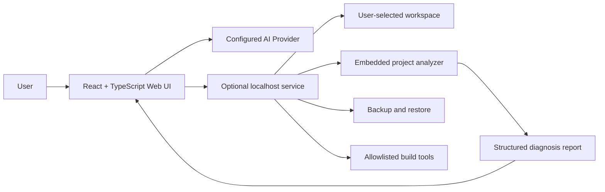

# MetaCore Studio

[English](./README_EN.md) | [简体中文](./README.md)

<p align="center">
  
</p>

> AI-assisted hardware architecture and embedded project analysis for ESP32, STM32, and custom chips.

面向 ESP32、STM32 与自定义芯片的 AI 硬件方案生成、固件设计和本地嵌入式工程分析平台。

Documentation language: English with Chinese UI names where they match the application.

[](https://react.dev/)
[](https://www.typescriptlang.org/)
[](https://vite.dev/)
[](https://nodejs.org/)
[](#release-status)
[](#license)

MetaCore Studio turns a natural-language hardware requirement into a structured embedded design workflow:

```text
Requirement -> Hardware scheme -> Pin/BOM/Wiring -> Firmware -> Flow graph -> Local diagnosis -> Export
```

The browser application handles the product interface and AI workflows. An optional localhost service adds controlled access to a user-selected embedded project directory for analysis, backups, editing, and build verification.

## Contents

- [Highlights](#highlights)
- [Architecture](#architecture)
- [Release Status](#release-status)
- [Sponsor](#sponsor)
- [Requirements](#requirements)
- [Quick Start](#quick-start)
- [Local Engineering Mode](#local-engineering-mode)
- [AI Providers](#ai-providers)
- [Example Project](#example-project)
- [Commands](#commands)
- [Security Boundaries](#security-boundaries)
- [Testing](#testing)
- [Versioning](#versioning)
- [Changelog](#changelog)
- [Troubleshooting](#troubleshooting)
- [Limitations](#limitations)
- [Contributing](#contributing)
- [GitHub Collaboration Files](#github-collaboration-files)
- [License](#license)

## Highlights

| Area | What it provides |
| --- | --- |
| Hardware design | Chip selection, GPIO allocation, BOM, wiring table, and pin visualization |
| Firmware generation | Modular C/C++ project generation for Arduino, PlatformIO, ESP-IDF, and STM32CubeIDE |
| Driver library | Built-in templates for SSD1306, DHT, AHT20, WS2812, HC-SR04, buzzer, servo, and DRV8833 |
| AI verification | Post-generation consistency checks against the selected hardware scheme |
| Flow visualization | Interactive execution-flow graph with code context and AI assistant |
| Custom chips | Datasheet parsing, AI-assisted form filling, and manual chip specification |
| Local engineering mode | Directory browsing, text search, code preview, static analysis, health scoring, and reports |
| Safe operations | User-confirmed file editing, modification-time conflict detection, automatic backups, and restore |
| Build verification | Detect and run allowlisted PlatformIO, ESP-IDF, and CMake builds |
| Export | ZIP firmware project packages and formatted PDF design documents |
| Project portability | Validated `.metacore.json` import and export without API keys |

## Architecture



The localhost service provides the local AI proxy and the `本地` workspace boundary. Requirement generation, chip management, code generation, flow graphs, and export can run in the browser, but the local proxy is recommended for AI providers that do not allow browser CORS.

## Release Status

Current release: **v2.3.0** (`2026-08-19`)

Version 2.3.0 completes the staged workflow from requirements, hardware scheme, pins, BOM, and wiring through firmware, flow, verification, and delivery export. It unifies Session, Job, SSE, cancellation, retry, and stale-artifact state, and verifies real workspace scanning plus a PlatformIO firmware build against the repository ESP32 example. The deterministic Mock Provider is used only for orchestration E2E and is not presented as a real DeepSeek call; the successful firmware build also does not imply that a physical board was flashed.

> [!IMPORTANT]
> MetaCore Studio generates engineering suggestions and code, not verified production hardware. Always validate pin assignments, electrical limits, dependencies, and firmware against the actual datasheet and target board.

> [!CAUTION]
> The local workspace can expose source files to the application. AI providers only receive local engineering context when you explicitly start an AI analysis, but you should still avoid selecting folders containing private keys, production credentials, or unrelated personal data.

## Sponsor

VPS.Town is a platform focused on VPS and cloud server services, providing stable and flexible cloud resources for developers, personal website owners, and project teams. Its services are suitable for website deployment, application hosting, development and testing, and personal project operations. We thank VPS.Town for supporting the development and open-source work of MetaCore Studio.

<a href="https://vps.town/" target="_blank" rel="noreferrer">
  
</a>

- [VPS.Town official website](https://vps.town/)

## Requirements

- Windows, macOS, or Linux
- Node.js 20.19 or newer
- npm 9 or newer
- A compatible AI provider, if you want AI generation or AI diagnosis
- PlatformIO, ESP-IDF, or CMake only when you want local build verification

## Quick Start

### Browser application

```bash
git clone https://github.com/LEO-Ricardo20/MetaCore-Studio.git
cd MetaCore-Studio
npm ci
npm run dev
```

Vite will print the local URL, normally `http://localhost:5173`.

For Windows, `start.bat` starts the browser-only application. It does not need the local file service.

## Local Engineering Mode

### Frontend and local service

The local mode runs as two processes:

```bash
# Terminal 1
npm run dev:server

# Terminal 2
npm run dev
```

Windows users can double-click `start-local.bat` to start both processes. The service listens on `127.0.0.1:3766` and the web UI normally runs on `127.0.0.1:5173`.

Open the `本地` page, set a workspace path, and click `扫描`. The analyzer can identify:

- PlatformIO, ESP-IDF, Arduino, STM32CubeIDE, and CMake projects
- ESP32, ESP32-S3, ESP32-C3, STM32F103, and STM32F4 references
- GPIO definitions and common pin calls
- DHT, OLED, WS2812, servo, motor, I2C, SPI, and UART clues
- Wi-Fi, MQTT, HTTP, WebSocket, BLE, LoRa, Zigbee, Modbus, and CoAP clues
- `#include` dependencies and PlatformIO `lib_deps`
- Code size, language distribution, and comment ratio
- Hard-coded credentials and plain-text network endpoints

The current workspace is not exposed to the public network by the service. File edits require confirmation and create a backup before writing.

API details are documented in [`docs/LOCAL_API.md`](docs/LOCAL_API.md).

## AI Providers

Configure providers from the `设置` page. The current client supports:

- DeepSeek
- SiliconFlow
- Qwen
- OpenAI Responses API
- Ollama-compatible local models
- Custom OpenAI-compatible endpoints

Custom endpoints can use either the Responses API or Chat Completions. CCH-compatible endpoints such as `autobits.cc` use the Responses API according to their provider documentation. Use the provider's `/models` response as the source of truth for model IDs.

AI keys are stored in the browser's `localStorage` by the current implementation. Browser storage is outside the Git working tree and is not included by `git add`, commit, or push. When the localhost service is running, AI requests use the local proxy; the service forwards the key only to the configured provider and does not persist it or write it to operation logs. If the proxy is unavailable, the client may fall back to a browser-direct request when the provider permits CORS.

MetaCore Studio does not currently provide a public cloud AI API. Future supplier integrations should implement the existing `call` and `listModels` adapter contract in a separately secured service with authentication, rate limits, and cost controls. Supplier secrets must never be committed to this repository.

Do not use a shared browser profile for production credentials. Clear the site's browser data before handing the computer to another user, never place real keys in source files, screenshots, issues, or exported configuration, and review the provider's privacy policy before sending source code or datasheets for analysis.

## Typical Workflow

1. Open `设置` and configure an AI provider.
2. Open `方案`, describe the hardware requirement, and select a target chip and project format.
3. Generate the hardware scheme and review the pin diagram, BOM, and wiring table.
4. Generate firmware code and run the built-in AI consistency check.
5. Open `流程` to inspect the generated execution flow.
6. Export a ZIP project or PDF design document.
7. Optionally open `本地`, select an existing embedded project, scan it, and review the diagnosis report.

## Example Project

The repository includes a small PlatformIO example for local analysis:

[`examples/esp32-smart-environment`](examples/esp32-smart-environment/)

It demonstrates ESP32, Wi-Fi, MQTT, DHT22, SSD1306, I2C, GPIO extraction, dependency detection, and PlatformIO build detection. Replace the example network settings before using it with real hardware.

The real-workspace browser smoke opens the verification workspace, clicks Scan, verifies PlatformIO, ESP32, Wi-Fi, MQTT, SSD1306, DHT, I2C, UART, and source-backed GPIO evidence, then runs the PlatformIO firmware build through the allowlisted build entry and verifies `SUCCESS`.

## Commands

| Command | Purpose |
| --- | --- |
| `npm run dev` | Start the Vite frontend |
| `npm run dev:server` | Start the localhost engineering service |
| `npm run lint` | Check TypeScript, React Hooks, browser, and Node.js source conventions |
| `npm run typecheck` | Run strict TypeScript checks |
| `npm run test` | Run AI result and frontend-service unit tests |
| `npm run build` | Type-check and create a production frontend build |
| `npm run preview` | Preview the production build with Vite |
| `npm run test:local` | Run the local service smoke test |
| `npm run test:e2e` | Verify generation, cancellation, retry, and background navigation with the deterministic mock provider |
| `npm run test:e2e:real` | Verify browser-based analysis and hardware evidence for the real ESP32 example workspace |
| `npm run verify:delivery` | Start or reuse local services and run all quality checks plus both browser smoke workflows |
| `npm run check` | Run lint, type checks, unit tests, local smoke tests, and the production build |

## Project Structure

```text
src/
├── components/          # React UI, pages, editors, diagrams, and local workspace panels
├── data/                # Chip specifications, code templates, and driver templates
├── services/            # AI, project archives, PDF, export, and local-service clients
├── store/               # Canonical project state and other browser stores
├── types/               # Domain types for hardware, projects, and AI services
└── App.tsx              # HashRouter routes
server/
├── index.mjs            # Local-service composition, files, analysis, backups, and builds
├── config.mjs           # Bind address, limits, and package metadata
├── lib/http.mjs         # JSON, CORS, origin, and request-body handling
├── security/            # Canonical workspace-path boundary
├── services/            # Replaceable AI provider adapter
└── smoke-test.mjs       # Self-contained local API smoke test
docs/
├── ARCHITECTURE.md      # Module boundaries and dependency direction
├── LOCAL_API.md         # Local service API reference
└── PROJECT_FILES.md     # Portable project format and safety limits
examples/
└── esp32-smart-environment/  # PlatformIO analysis example
public/
├── fonts/              # Fonts used by PDF export
├── apple-touch-icon.png # Apple touch icon
├── logo.svg            # Project Logo and browser icon
├── logo-64.png         # Browser favicon fallback
└── sponsor.png         # VPS.Town sponsor banner
.github/
├── ISSUE_TEMPLATE/     # GitHub issue forms
└── PULL_REQUEST_TEMPLATE.md
```

## Security Boundaries

The local service is designed for a local development workflow, not as a general remote file server:

- It binds to `127.0.0.1` only.
- It rejects non-local browser origins.
- Every path is normalized and checked against the selected workspace.
- Scans skip `.git`, `node_modules`, build outputs, and backup directories.
- Text reads and request bodies have size limits.
- File saves compare the original modification time to avoid overwriting external edits.
- Builds use fixed server-side profiles instead of arbitrary commands or arguments.
- The AI provider does not receive local files unless the user explicitly starts an AI analysis.

### Operational notes

- Backups are written to `.metacore-backups` inside the selected workspace.
- Build verification can create normal tool output such as `.pio`, `build`, or generated artifacts.
- Clearing browser storage removes saved projects and AI configuration from the browser.
- Export `.metacore.json` archives from the project manager before clearing browser storage. Archives do not contain API keys.
- Static hosting only provides browser features; the local workspace page still requires `npm run dev:server` on the user's machine.
- API keys must not be committed to this repository or placed in the example project.

## Testing

Run the complete delivery gate:

```bash
npm run verify:delivery
```

Unit tests validate AI result structures, canonical project state, portable project archives, flow references, and generated-file path safety. The local service test creates a temporary PlatformIO-like project and verifies workspace setup, directory listing, linked-path escape protection, ESP32 and IoT protocol detection, dependency extraction, file writing with backup, report generation, build profile detection, AI proxy calls, model discovery, Responses API handling, and upstream error propagation.

`test:e2e` uses an explicitly labeled deterministic mock provider to verify the AI orchestration state machine; it is not a real DeepSeek call. `test:e2e:real` uses the repository ESP32 project to verify the actual local-analysis UI and PlatformIO build. Other projects still require their matching local PlatformIO, ESP-IDF, or CMake toolchain and dependencies.

Run the production build before submitting changes:

```bash
npm run build
```

## Versioning

MetaCore Studio follows [Semantic Versioning](https://semver.org/):

- **Major** (`2.0.0`): incompatible architecture or workflow changes
- **Minor** (`2.3.0`): backward-compatible features or workflow updates
- **Patch** (`2.0.1`): backward-compatible fixes and documentation corrections

The canonical application version is stored in `package.json`. The frontend and localhost service read this value at runtime. Release-facing scripts and the changelog should be updated in the same release commit.

## Changelog

See [`CHANGELOG.md`](CHANGELOG.md) for release history and migration notes.

## Troubleshooting

### AI generation fails

- Confirm an active provider and API key on `设置`.
- Check the provider endpoint and model name.
- For Ollama, start `ollama serve` and confirm the model is installed.
- Check browser developer tools for CORS or provider-side errors.

### The local page says the service is offline

Start the service in the project directory:

```bash
npm run dev:server
```

Then click `刷新连接` in the local workspace page.

### A build profile is disabled

The project marker may exist, but the corresponding tool is not available in `PATH`. Install PlatformIO, ESP-IDF, or CMake and restart the local service.

## Limitations

- Static analysis is rule-based and cannot fully understand complex macros, generated code, or every conditional compilation path.
- Pin validation depends on the detected chip and the available local knowledge base.
- Arduino CLI compilation requires an explicit board FQBN and is not enabled as an automatic build profile yet.
- Generated hardware designs and firmware must be reviewed against the actual datasheet and hardware.
- This project does not replace electrical safety review, security review, or hardware-in-the-loop testing.

## Contributing

1. Create a feature branch.
2. Keep UI changes consistent with the existing React, TypeScript, Tailwind, and Zustand patterns.
3. Keep local filesystem operations inside the workspace security boundary.
4. Add or update the local smoke test when changing server behavior.
5. Run `npm run check` before opening a pull request.

## GitHub Collaboration Files

- [Contributing guide](CONTRIBUTING.md): Branch, commit, testing, and pull request conventions.
- [Architecture guide](docs/ARCHITECTURE.md): Frontend, localhost service, and dependency boundaries.
- [Security policy](SECURITY.md): Handling vulnerabilities, API keys, and sensitive information.
- [Code of conduct](CODE_OF_CONDUCT.md): Basic expectations for public collaboration.
- `.github/ISSUE_TEMPLATE/`: Bug report and feature request forms.
- `.github/PULL_REQUEST_TEMPLATE.md`: Pull request checklist.

## License

The repository currently uses an **All Rights Reserved** notice. The source is published on GitHub for reference and collaboration, but it is not granted an OSI-approved open-source license at this time. Do not redistribute, relicense, or use the code commercially without permission from the copyright holder. See [`LICENSE`](LICENSE) for the full text.

© 2026 Leo. All rights reserved.
