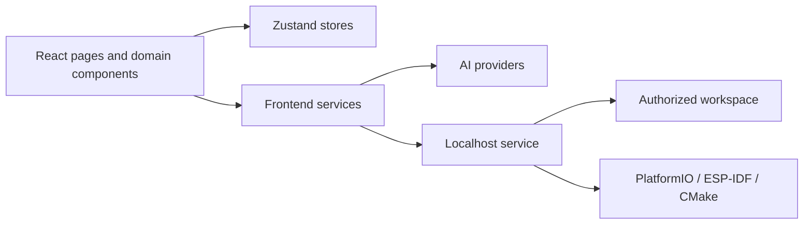

# MetaCore AI Architecture

[English](#english) | [简体中文](#简体中文)

## English

MetaCore AI has two runtime layers:

1. A React browser application for project state, hardware workflows, AI interaction, visualization, and export.
2. An optional Node.js localhost service for AI proxying, controlled workspace access, analysis, backups, editing, and allowlisted builds.

### Frontend module boundaries

- `src/components/brand`: Reusable brand primitives such as the application Logo.
- `src/components/layout`: Navigation and page-shell components.
- `src/components/pages`: Route-level composition. Pages should delegate reusable behavior to domain components and services.
- `src/components/*`: Domain UI for requirements, code generation, flow visualization, chips, drivers, projects, and local analysis.
- `src/config`: Side-effect-free application metadata and shared configuration.
- `src/services`: AI, local API, PDF, ZIP, and parsing integrations. Services must not import route-level pages.
- `src/store`: Zustand state and browser persistence boundaries.
- `src/data`: Static chip, code, and driver knowledge.
- `src/types`: Shared domain contracts.

### Localhost service boundaries

- The service binds to loopback interfaces only.
- Workspace paths are normalized and checked before filesystem access.
- Browser requests cannot provide arbitrary shell commands.
- File writes preserve backup and modification-conflict checks.
- AI proxy behavior remains separate from workspace authorization decisions.

### Dependency direction

Route pages may depend on domain components, stores, services, configuration, and shared types. Services and stores must not depend on route pages. Static configuration should remain free of browser or filesystem side effects.

## 简体中文

MetaCore AI 包含两个运行层：React 浏览器应用负责项目状态、硬件流程、AI 交互、可视化和导出；可选的 Node.js localhost 服务负责 AI 代理、受控工作区访问、工程分析、备份、编辑和白名单构建。

### 前端模块边界

- `src/components/brand`：Logo 等可复用品牌组件。
- `src/components/layout`：导航和页面框架。
- `src/components/pages`：路由级页面组合，不承载可复用底层逻辑。
- `src/components/*`：需求、代码、流程、芯片、外设、项目和本地分析等领域 UI。
- `src/config`：无副作用的应用元数据和共享配置。
- `src/services`：AI、本地 API、PDF、ZIP 和解析集成，不反向依赖页面。
- `src/store`：Zustand 状态与浏览器持久化边界。
- `src/data`：芯片、代码和驱动静态知识。
- `src/types`：共享领域类型。

新增功能时应优先遵守现有模块边界；同一行为或视觉元素出现多次时提取可复用组件；涉及本地文件系统、命令执行和 AI 上下文提交时，必须保持现有安全检查。
