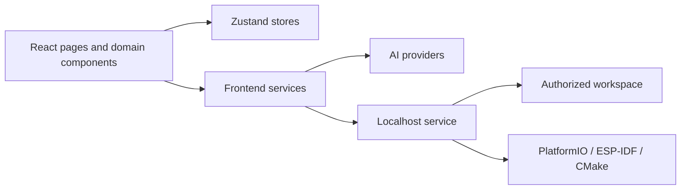

# MetaCore AI Architecture

[English](#english) | [简体中文](#简体中文)

## English

MetaCore AI has two runtime layers:

1. A React browser application for project state, hardware workflows, AI interaction, visualization, and export.
2. An optional Node.js localhost service for AI proxying, controlled workspace access, analysis, backups, editing, and allowlisted builds.

### Frontend module boundaries

- `src/components/brand`: Reusable brand primitives such as the application Logo.
- `src/components/layout`: Navigation and page-shell components.
- `src/components/pages`: Route-level composition. Pages should delegate reusable behavior to domain components and services.
- `src/components/*`: Domain UI for requirements, code generation, flow visualization, chips, drivers, projects, and local analysis.
- `src/config`: Side-effect-free application metadata and shared configuration.
- `src/services`: AI, local API, PDF, ZIP, and parsing integrations. Services must not import route-level pages.
- `src/services/ai/validation.ts`: Runtime trust boundary for all structured AI output before it reaches application state.
- `src/services/projects/portableProject.ts`: Versioned trust boundary for portable project archives.
- `src/store/projectStore.ts`: The single canonical source for the project list and active project ID.
- `src/store`: Other Zustand browser persistence boundaries, including AI, chips, settings, and theme.
- `src/data`: Static chip, code, and driver knowledge.
- `src/types`: Shared domain contracts.

### Localhost service boundaries

- The service binds to loopback interfaces only.
- Workspace paths are normalized and checked before filesystem access.
- Workspace and target paths are canonicalized with `realpath`; symbolic links and directory junctions cannot escape the selected root.
- Browser requests cannot provide arbitrary shell commands.
- File writes preserve backup and modification-conflict checks.
- AI proxy behavior remains separate from workspace authorization decisions.
- `server/config.mjs`, `server/lib/http.mjs`, and `server/security/workspace-paths.mjs` own runtime configuration, HTTP boundaries, and canonical path checks.
- `server/services/ai-provider.mjs` exposes the `call` / `listModels` adapter contract. No public cloud API or supplier credential is bundled.

### Dependency direction

Route pages may depend on domain components, stores, services, configuration, and shared types. Services and stores must not depend on route pages. Static configuration should remain free of browser or filesystem side effects.

Route pages and heavy editor, PDF, flow, and export dependencies are loaded on demand. AI page actions and the one-click pipeline must call the same workflow services rather than duplicating provider and parsing logic inside components.

Portable project files contain only the selected project's design data. AI service configuration, API keys, local workspace paths, operation logs, and backups are outside the archive schema.

## 简体中文

MetaCore AI 包含两个运行层：React 浏览器应用负责项目状态、硬件流程、AI 交互、可视化和导出；可选的 Node.js localhost 服务负责 AI 代理、受控工作区访问、工程分析、备份、编辑和白名单构建。

### 前端模块边界

- `src/components/brand`：Logo 等可复用品牌组件。
- `src/components/layout`：导航和页面框架。
- `src/components/pages`：路由级页面组合，不承载可复用底层逻辑。
- `src/components/*`：需求、代码、流程、芯片、外设、项目和本地分析等领域 UI。
- `src/config`：无副作用的应用元数据和共享配置。
- `src/services`：AI、本地 API、PDF、ZIP 和解析集成，不反向依赖页面。
- `src/services/ai/validation.ts`：所有结构化 AI 输出进入应用状态前的运行时可信边界。
- `src/services/projects/portableProject.ts`：带版本的项目归档导入可信边界。
- `src/store/projectStore.ts`：项目列表和当前项目 ID 的唯一状态源。
- `src/store`：AI、芯片、设置和主题等其他浏览器持久化边界。
- `src/data`：芯片、代码和驱动静态知识。
- `src/types`：共享领域类型。

路由页面以及编辑器、PDF、流程图和导出等重型依赖按需加载。页面按钮与一键流水线必须复用同一套 AI 工作流服务，不能在组件中重复实现服务商调用和解析逻辑。

本机服务将运行配置、HTTP/CORS、工作区真实路径安全和 AI 兼容传输分别放在 `server/config.mjs`、`server/lib/http.mjs`、`server/security` 与 `server/services`。供应商扩展只需要实现 `call` 和 `listModels` 契约；当前仓库不包含公共云端 AI API、共享密钥或计费逻辑。

项目归档只包含项目设计数据，不包含 AI 服务配置、API Key、本地工作区路径、操作日志或备份。

新增功能时应优先遵守现有模块边界；同一行为或视觉元素出现多次时提取可复用组件；涉及本地文件系统、命令执行和 AI 上下文提交时，必须保持现有安全检查。工作区路径和目标路径必须通过真实路径校验，符号链接或 Windows 目录联接不得逃逸用户选择的根目录。
