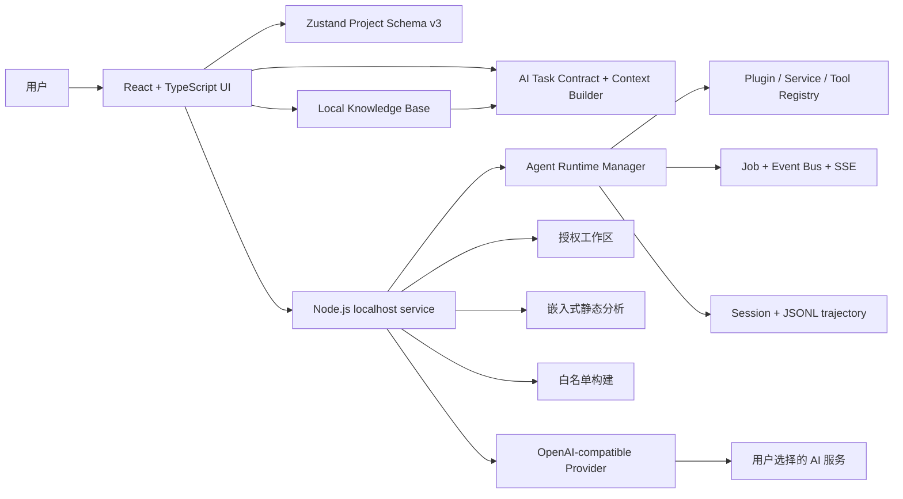

# MetaCore Studio 系统架构

MetaCore Studio 由 React 浏览器应用和 Node.js localhost 服务组成。浏览器负责项目生命周期、交互、AI 工作流、可视化和导出；本地服务负责 AI 代理、受控工作区访问、静态分析、备份、构建、后台 Job 和 Session trajectory。

## 总体结构



默认完整模式地址：

- Web UI：`http://127.0.0.1:5173`
- localhost API：`http://127.0.0.1:3766/api`

## 前端信息架构

一级导航收敛为五个研发板块：

| 路由 | 页面组合 | 责任 |
| --- | --- | --- |
| `/workspace` | `WorkspacePage` | 当前项目、阶段、产物、连接状态和最近运行 |
| `/design/*` | `DesignWorkspacePage` | 需求、芯片、外设、方案、引脚、BOM、接线和审查 |
| `/implementation/*` | `ImplementationWorkspacePage` | 固件生成、Monaco、版本、一致性状态和导出 |
| `/verification/*` | `VerificationWorkspacePage` | 一致性、流程、本地分析、构建、安全和发布检查 |
| `/projects` | `ProjectManager` | 项目管理和归档 |

`/settings`、`/help` 和 `/about` 位于系统区域。旧的 requirement、codegen、flow、local、chips 和 drivers 路由使用重定向保持兼容。

## 前端模块边界

```text
src/
├── components/
│   ├── layout/          # 桌面侧边栏、移动抽屉和页面框架
│   ├── pages/           # 路由级工作区组合
│   ├── requirement/     # 需求和硬件方案 UI
│   ├── codegen/         # 文件树、Monaco、代码检查和导出
│   ├── flow/            # ReactFlow 和工程问答
│   ├── local/           # 本地工作区浏览、分析、编辑和构建
│   ├── project/         # 项目列表与归档
│   ├── esp32/           # ESP32 开发板配置向导与 profile 摘要
│   └── settings/        # AI 服务配置
├── services/
│   ├── ai/              # Provider 客户端、Prompt、Contract、上下文和验证
│   ├── local/           # localhost API 和 SSE 客户端
│   ├── esp32/           # 板卡配置规范化、工具链与 GPIO 校验
│   └── projects/        # 生命周期和可移植项目归档
├── knowledge/           # 本地器件知识包、校验、注册表和兼容适配
├── store/               # Zustand 持久化与会话状态
├── types/               # Project、Agent、AI 和硬件共享类型
└── data/                # 芯片、驱动和模板静态知识
```

依赖方向：

- 路由页可以依赖领域组件、Store、Service、配置和共享类型。
- Service 和 Store 不依赖路由页。
- AI 结构化输出必须先经过 Contract 和任务专用验证器，不能直接进入 Store。
- 芯片、板卡和元器件事实必须通过本地知识库查询，生成流程不能把模糊搜索结果当成已解析型号。
- 项目导入必须先经过 `portableProject.ts` 可信边界。
- 页面按钮和一键流水线复用同一套 AI workflow service，不在组件中复制 Provider 调用与解析逻辑。

## Project Schema v3

`src/types/project.ts` 定义统一领域模型：

- `ProjectStage`：项目主状态。
- `PipelineStage` / `PipelineStageState`：十阶段流水线及运行信息。
- `ArtifactKey` / `ArtifactState`：核心产物、版本与 stale 状态。
- `ProjectRun`：一次可取消、可重试的流水线记录。
- `ProjectVersion`：显式创建的项目版本。
- `ProjectValidationSummary`：项目质量门禁。
- `TokenUsage`：输入、输出、总 Token 和可选费用估算。
- `Esp32ProjectConfig`：ESP32 SoC、模组、开发板、构建标识、存储、USB、分区和串口配置。

Zustand `metacore-projects` 的持久化版本升级为 3。迁移会补齐生命周期字段，并为旧 ESP32 项目推断兼容的默认开发板 profile，不清空旧 localStorage。

详细行为见 [PRODUCT_WORKFLOW.md](./PRODUCT_WORKFLOW.md)。

## 本地器件知识库

`src/types/knowledge.ts` 定义知识库 Schema v1；`src/knowledge` 实现知识包校验、原子安装、冲突与依赖检查、查询、严格型号解析和版本快照。

知识实体由身份、结构化事实、引脚、接口、约束、关系、驱动和来源证据组成。关键事实必须有证据；`verified` 实体必须引用厂商官方来源。UI 模糊搜索与生成流程的严格解析是两个不同入口，未知型号不能静默匹配到相似芯片。

当前同时安装两个只读知识包：`metacore.legacy-core@1.0.0` 提供历史数据兼容；`metacore.hardware-core@1.0.0` 提供 8 个 ESP32/STM32 MCU 实体和 33 个教学元器件实体。正式包优先级高于 legacy 包，但使用独立实体 ID，旧项目目标名称继续通过别名兼容。

`src/knowledge/context.ts` 严格解析目标芯片，从需求、BOM 和方案文本匹配器件别名，并只向方案、代码生成和 AI 一致性检查提示词注入当前任务相关的电压、IO、电流、接口、地址、限制、驱动和来源摘要。未匹配器件会明确标记为未收录，不能通过模糊搜索静默替代。当前实体统一为 `reviewed`；联网官方同步和按需文档检索尚未启用。详细模型、可信状态和扩展规则见 [KNOWLEDGE_BASE.md](./KNOWLEDGE_BASE.md)。

## AI 可信边界

AI 集成拆为四层：

1. Provider Client：默认只向 localhost MetaCore 网关发送请求，由网关调用兼容服务并统一处理取消、超时、协议和传输错误。
2. Task Contract：要求版本化 envelope，校验 `schemaVersion`、`taskType` 和 `status`。
3. Domain Parser：验证硬件方案、代码文件、流程节点和一致性结果。
4. Project Store：只有通过解析和验证的数据才能更新项目状态。

Task Contract 首次解析失败时只执行一次 repair 请求；repair 仍失败才向 UI 返回错误。Contract 会保留 assumptions、openQuestions、risks、evidence 和 validationHints，避免把无法证实的芯片参数或引脚当作确定事实。

## Context Builder

流程图和一致性验证使用基于相关性的代码上下文，不再固定截取文件头：

- 排除依赖、构建、备份和覆盖率目录。
- 对凭据赋值和 Bearer Token 脱敏。
- 建立函数索引和真实行号。
- 提升 setup、loop、app_main、任务、初始化和错误处理的相关性。
- 根据引脚、宏、函数、外设和任务关键词评分。
- 在 Token 预算内选择完整文件或函数片段。
- 把文件、函数、分数和估算 Token 作为 context manifest 返回。

浏览器和服务端保留各自实现，以维持 Web/Node 运行边界；两者应通过测试保持规则一致。

## Localhost 服务边界

```text
server/
├── index.mjs                 # HTTP 组合入口和旧 API 兼容路由
├── config.mjs                # 监听地址、端口、限制和包元数据
├── lib/http.mjs              # JSON、CORS、Origin 和请求体边界
├── security/workspace-paths.mjs
│                              # 工作区 realpath 与 symlink/junction 防逃逸
├── services/ai-provider.mjs  # OpenAI-compatible Provider Adapter
├── agent/                    # Runtime manager, Harness adapter, jobs, sessions, approvals and tools
└── smoke-test.mjs            # 本地 API、安全和 Job/SSE 冒烟测试
```

现有文件、分析、备份、恢复、构建、报告和 AI API 路径保持兼容。所有响应设置 Request ID，错误通过稳定 code、message、retryable、requestId 和可选 details 规范化。

## Agent Runtime

`server/agent` 实现：

- 静态 Plugin Registry。
- Service Definition / Provider Registry。
- Tool Registry 和权限/审批流水线。
- Event Bus。
- 并发数为 2 的后台 Job Manager。
- AbortController 取消和失败重试。
- Job/Session SSE。
- 独立 Session Root、JSON 元数据和 JSONL trajectory。
- 日志与 Session 脱敏。

`server/agent` 同时提供 `InternalAgentRuntime` 和可选的 `DeepSeekHarnessRuntime`。后者通过旁边源码 checkout 的官方 JSON-RPC packaged bin 接入 Cordis；两者都由 `AgentRuntimeManager` 统一映射为 MetaCore Job、Session 和 SSE 事件。详细说明见 [AGENT_ARCHITECTURE.md](./AGENT_ARCHITECTURE.md)。

## 工作区与文件系统

工作区由用户显式设置。文件系统访问遵循：

1. 将输入路径解析到工作区根目录。
2. 拒绝词法路径越界。
3. 对存在目标执行 `realpath`。
4. 拒绝符号链接或 Windows 目录联接逃逸。
5. 应用文件类型、大小、扫描深度和扫描数量限制。

写入前比较 `expectedModifiedAt`，外部修改返回 HTTP 409。成功写入前在 `.metacore-backups` 创建备份。恢复操作也会先备份当前文件。

## 构建边界

前端只能传入 `platformio`、`espidf` 或 `cmake` profile ID。命令和参数由服务端固定，浏览器不能传入任意 Shell 命令。构建有 120 秒超时、512 KB 输出限制，并支持后台 Job AbortSignal。

## Session 与日志

Session Root 默认位于操作系统用户数据目录，而不是用户工程：

- Windows：`%LOCALAPPDATA%\MetaCore Studio\sessions`
- 其他系统：`~/.metacore-studio/sessions`

`operations.jsonl` 保存脱敏后的操作记录；`<sessionId>.json` 保存 Session 元数据；`<sessionId>.jsonl` 保存 trajectory。服务启动时默认清理超过 7 天的 Session。

当前 Job 和 EventBus 仍为进程内状态，服务重启不会恢复队列或重放历史 SSE。Session 元数据可以读取，但不是完整的可恢复分布式任务系统。

## 项目归档边界

项目内部 Schema 为 v2，但可移植归档 envelope 继续使用：

```json
{
  "kind": "metacore.project",
  "schemaVersion": 1,
   "appVersion": "2.6.0",
  "exportedAt": "ISO-8601",
  "project": {}
}
```

归档包含生命周期状态、版本和脱敏后的运行摘要，但不包含 API Key、本地工作区、Session 引用、原始 AI 响应、结构化诊断结果、日志或备份。

## 性能策略

- 路由页和 Monaco、ReactFlow、PDF、ZIP 等重型模块按需加载。
- Vite/Rolldown 对 PDF renderer、字体引擎和支持依赖进行异步分组。
- `DesignWorkspacePage` 已低于 500 KB 警告阈值。
- PDF renderer 与 PDF worker 仍是大型异步 chunk；这是当前构建的已知性能风险，不能通过简单提高 warning limit 隐藏。
- 不引入大型动画库；交互动效支持 `prefers-reduced-motion`。

## 设计约束

- 不将所有阶段塞入单个巨型页面或单个布尔状态对象。
- 不让 AI 原始输出直接进入应用状态。
- 不让浏览器传入任意命令。
- 不让 Agent Tool 绕过工作区、审批、备份和构建白名单。
- 不把 Session、日志和本地路径写入项目归档。
- 不把 Internal Runtime 描述为实际 DeepSeek Harness 集成。
- 新增跨模块行为时，测试范围应覆盖 Store、归档、AI Contract、本地 API 和安全边界。
